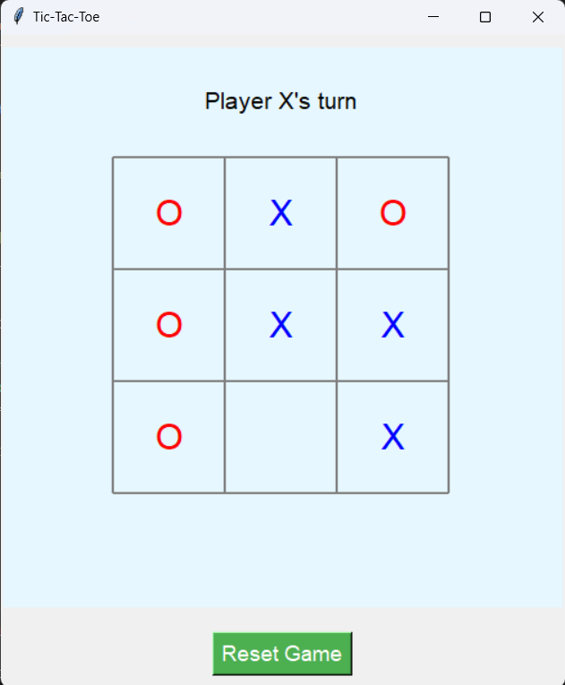

# TicTacToeGame

This Python script is a GUI-based implementation of the classic Tic-Tac-Toe game using the tkinter library. The game supports two players who alternate turns, with a simple interface to make moves and reset the game.

<h2>Features</h2>
<b>Interactive Gameplay:</b>

- Players click on grid cells to place their marker (X or O).
Turn alternates between players automatically.

<b>Winner Detection:</b>

- Checks rows, columns, and diagonals for a winning combination.
Displays a message when a player wins and disables further moves.

<b>Reset Option:</b>

- A "Reset Game" button clears the board and restarts the game.

<b>User-Friendly UI:</b>

- Visual grid and markers (X in blue and O in red).
Instructions and real-time player turn display.

